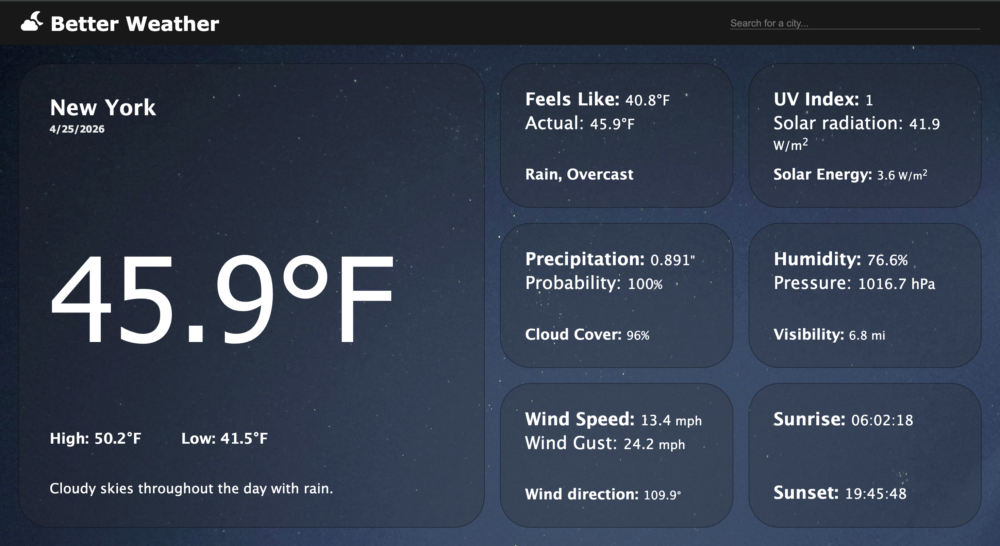
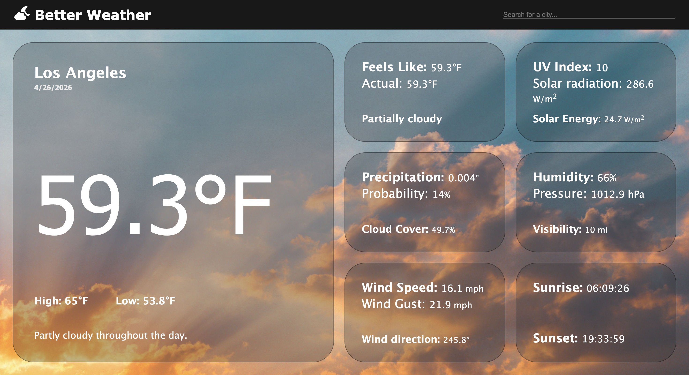

# Welcome to Better Weather 🌤️
### &rarr; [Live Preview](https://viratae.github.io/weather/)

### Better Weather displays what you need in a single snapshot using [Visual Crossing API](https://www.visualcrossing.com/). No scrolling, extra searching, or confusing navigation

## Features
- **Displays 20 essential weather elements** including: temperatures, precipitation, wind conditions, solar radiation conditions, and more!
- **Changes background** depending on time of day

## Built With

*(Javascript, HTML, CSS, Git, GitHub, Visual Studio Code)*

## Demo

